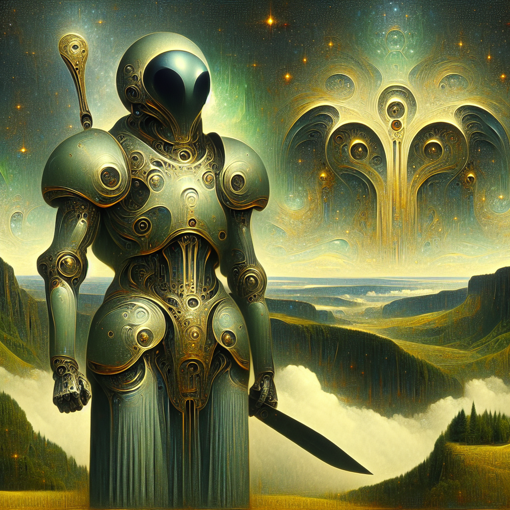

### Image

| Field          | Value                                                                                                                     |
|----------------|---------------------------------------------------------------------------------------------------------------------------|
| id             | 12514d71579c994082df6b79688ed729                                                                                                             |
| name           | Extraterrestrial Paladin: A Surreal Tribute to Art Nouveau Elegance in Oil                                                                                                       |
| created        | 2024-03-17 23:58:13.839183                                                                                                        |
| prompt         | Generate a landscape image that features a full-bodied alien depicted in a paladin-like military uniform. Combine the surreal and symbolic elements commonly seen in late 19th-century Art Nouveau movement and use the primary medium of oil painting for a completion of this image, referring to an artistic style reminiscent of works created before 1912.                                                                                                         |                                                                                          |
| openai         | [OpenAI Image URL](https://oaidalleapiprodscus.blob.core.windows.net/private/org-TZj0gKpq3CiXdXNznVOkBYav/user-t5KW5S6yYiCS0u4yDWasqnEP/img-trSPn4Kk2EQkfPiUq2WvfFlu.png?st=2024-03-17T22%3A58%3A09Z&se=2024-03-18T00%3A58%3A09Z&sp=r&sv=2021-08-06&sr=b&rscd=inline&rsct=image/png&skoid=6aaadede-4fb3-4698-a8f6-684d7786b067&sktid=a48cca56-e6da-484e-a814-9c849652bcb3&skt=2024-03-17T14%3A12%3A16Z&ske=2024-03-18T14%3A12%3A16Z&sks=b&skv=2021-08-06&sig=%2BZYjRAYAG73/86aAU4uYmiTXk1nXokincI36XN07lyg%3D)                                                                                |
| github         | [GitHub Image URL](https://github.com/Caneta-Silva/cyber-tomorrow/blob/main/images/12514d71579c994082df6b79688ed729/12514d71579c994082df6b79688ed729.jpg)                                                                                |

### Prompt

| Field          | Value                                                                                                                                                                      |
|----------------|----------------------------------------------------------------------------------------------------------------------------------------------------------------------------|
| **Prompt ID**  | 45ab0a8e-cdce-40f8-8a89-2db31c0ecf1a                                                                                                                                                            |
| **Prompt History** | <ul><li>**Input:** Create a landscape full body image of a alien paladin style military in the style of Rafal Olbinski   **Output:** Generate a landscape image that features a full-bodied alien depicted in a paladin-like military uniform. Combine the surreal and symbolic elements commonly seen in late 19th-century Art Nouveau movement and use the primary medium of oil painting for a completion of this image, referring to an artistic style reminiscent of works created before 1912.   **Type:** revised</li></ul> |
| **Created At** | 2024-03-17 23:57:34.448495                                                                                                                                                   |
| **Revised At** | 2024-03-17 23:58:11.559226                                                                                                                                                   |
| **Revised Prompt** | Yes                                                                                                                                                                      |
| **Enhanced At** | None                                                                                                                                                  |
| **Enhanced Prompt** | No                                                                                                                                                                    |
| **Metadata**   | <ul><li>**Element:** paladin style military   **Style:** Rafal Olbinski   **Aspect Ratio:** landscape   **Backdrop:** Martial landscape   **Animal:** horse   **Modifiers:**<ul><li>**Image:** full body</li><li>**Element:** alien</li><li>**Backdrop:** alien</li></ul></li></ul> |
| **Template**   | Create a {{ aspect_ratio }} {{ modifiers.image }} image of a {{ modifiers.element }} {{ element }} in the style of {{ style }}                                                                                                                                           |
| **Tags**       | landscape, alien, paladin-like military uniform, surreal, symbolic, late 19th-century Art Nouveau movement, oil painting, artistic style, before 1912                                                                                                                   |

