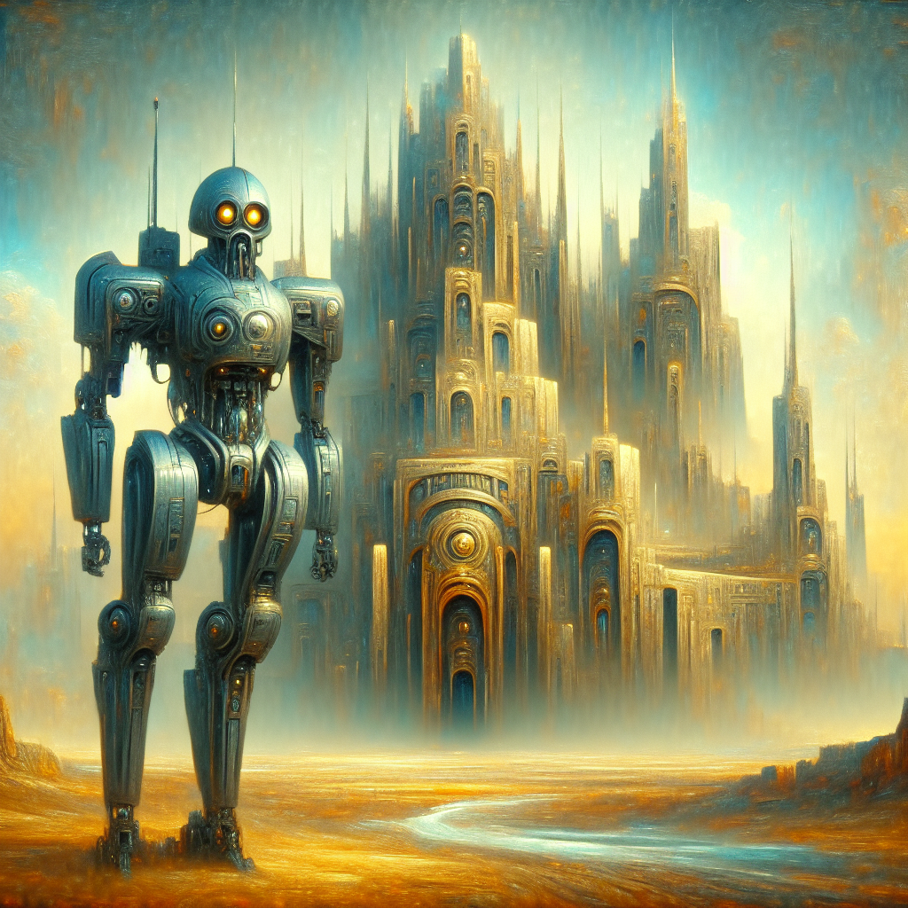

### 📷 317fe964bd71b7a8eb28467369d4da82 

| Field          | Value                                                                                                                     |
|----------------|---------------------------------------------------------------------------------------------------------------------------|
| **Image ID**             | 317fe964bd71b7a8eb28467369d4da82                                                                                                             |
| **Title**           | Sentinel of the Alien Fortress                                                                                                       |
| **Description**           | Create an intriguing image of an alien riot police robot standing in guard position before an imposing alien fortress. Use atmospheric, surrealistic, and detail-oriented artistry reminiscent of the Symbolist era, with the dominant medium being oil paints. The grandeur of the fortress should cast an enigmatic and mighty presence, located as a towering edifice in the background. The robotic sentinel, equipped with state-of-the-art technology, is ready and alert to defend its territory. Merge elements of futuristic design and unusual beauty to manifest a scene that stimulates the imagination and transports spectators to a mesmerizing extraterrestrial world.                                                                                                       |
| **CreatedAt**        | 2024-03-19 01:25:44.594407                                                                                                        |
| **OpenAI**         | [OpenAI Image URL](https://oaidalleapiprodscus.blob.core.windows.net/private/org-TZj0gKpq3CiXdXNznVOkBYav/user-t5KW5S6yYiCS0u4yDWasqnEP/img-xwDFPzqjp8lozGDiH7BFgd8b.png?st=2024-03-19T00%3A25%3A40Z&se=2024-03-19T02%3A25%3A40Z&sp=r&sv=2021-08-06&sr=b&rscd=inline&rsct=image/png&skoid=6aaadede-4fb3-4698-a8f6-684d7786b067&sktid=a48cca56-e6da-484e-a814-9c849652bcb3&skt=2024-03-19T00%3A11%3A08Z&ske=2024-03-20T00%3A11%3A08Z&sks=b&skv=2021-08-06&sig=yU2L/wjY0ABUL6IEz9wsu6PEirLU36wvVKtZ72LanQ8%3D)                                                                                |
| **GitHub**         | [GitHub Image URL](https://github.com/Caneta-Silva/cyber-tomorrow/blob/main/images/317fe964bd71b7a8eb28467369d4da82/317fe964bd71b7a8eb28467369d4da82.jpg)                                                                                |
| **Tags**       | None                                                                                                                   |

### 📜 1f6ee357-e3ed-47e6-b15b-616927777d32

> Create an intriguing image of an alien riot police robot standing in guard position before an imposing alien fortress. Use atmospheric, surrealistic, and detail-oriented artistry reminiscent of the Symbolist era, with the dominant medium being oil paints. The grandeur of the fortress should cast an enigmatic and mighty presence, located as a towering edifice in the background. The robotic sentinel, equipped with state-of-the-art technology, is ready and alert to defend its territory. Merge elements of futuristic design and unusual beauty to manifest a scene that stimulates the imagination and transports spectators to a mesmerizing extraterrestrial world.

| Field          | Value                                                                                                                                                                      |
|----------------|----------------------------------------------------------------------------------------------------------------------------------------------------------------------------|
| **Prompt ID**  | 1f6ee357-e3ed-47e6-b15b-616927777d32                                                                                                                                                            |
| **Prompt History** | <ul><li>**Input:**    **Output:**    **Type:** </li></ul><ul><li>**Input:** Create a landscape full body image of a alien riot police robot in the style of Rafal Olbinski against the backdrop of a alien fortress   **Output:** A captivating image depicting an alien riot police robot standing guard in front of a majestic alien fortress, inspired by the iconic style of artist Rafal Olbinski. The towering fortress looms in the background, exuding an aura of mystery and power, while the robotic sentinel is ready to defend its grounds with advanced technology and precision. The design blends futuristic elements with a touch of otherworldly beauty, creating a scene that captures the imagination and transports viewers to a fascinating alien world.   **Type:** enhanced</li></ul><ul><li>**Input:** A captivating image depicting an alien riot police robot standing guard in front of a majestic alien fortress, inspired by the iconic style of artist Rafal Olbinski. The towering fortress looms in the background, exuding an aura of mystery and power, while the robotic sentinel is ready to defend its grounds with advanced technology and precision. The design blends futuristic elements with a touch of otherworldly beauty, creating a scene that captures the imagination and transports viewers to a fascinating alien world.   **Output:** Create an intriguing image of an alien riot police robot standing in guard position before an imposing alien fortress. Use atmospheric, surrealistic, and detail-oriented artistry reminiscent of the Symbolist era, with the dominant medium being oil paints. The grandeur of the fortress should cast an enigmatic and mighty presence, located as a towering edifice in the background. The robotic sentinel, equipped with state-of-the-art technology, is ready and alert to defend its territory. Merge elements of futuristic design and unusual beauty to manifest a scene that stimulates the imagination and transports spectators to a mesmerizing extraterrestrial world.   **Type:** revised</li></ul> |
| **Created At** |                                                                                                                                                    |
| **Revised At** | 2024-03-19 01:25:42.343392                                                                                                                                                   |
| **Revised Prompt** | Yes                                                                                                                                                                      |
| **Enhanced At** | 2024-03-19 01:24:57.660254                                                                                                                                                  |
| **Enhanced Prompt** | Yes                                                                                                                                                                    |
| **Metadata**   | <ul><li>**Element:** riot police robot   **Style:** Rafal Olbinski   **Aspect Ratio:** landscape   **Backdrop:** fortress   **Animal:** gnu   **Modifiers:**<ul><li>**Image:** full body</li><li>**Element:** alien</li><li>**Backdrop:** alien</li></ul></li></ul> |
| **Template**   | Create a {{ aspect_ratio }} {{ modifiers.image }} image of a {{ modifiers.element }} {{ element }} in the style of {{ style }} against the backdrop of a {{ modifiers.backdrop }} {{ backdrop }}                                                                                                                                           |

