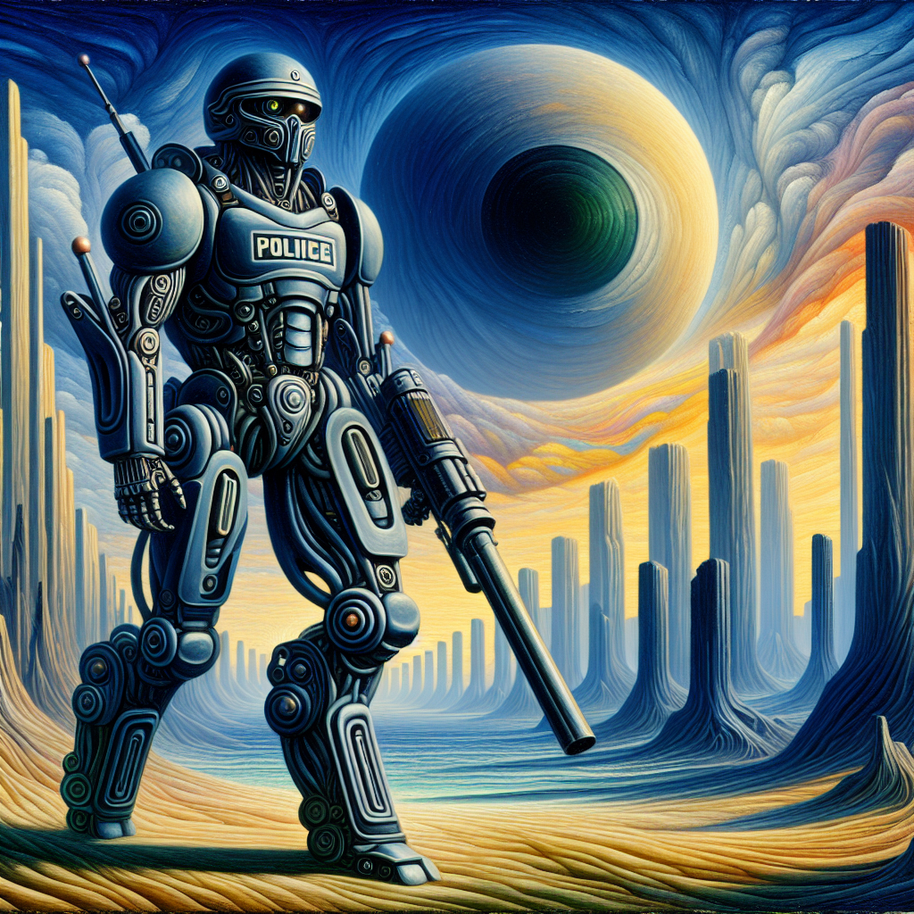

### 📷 3519bc2bf561bffcecbed30c45d267ef 

| Field          | Value                                                                                                                     |
|----------------|---------------------------------------------------------------------------------------------------------------------------|
| **Image ID**             | 3519bc2bf561bffcecbed30c45d267ef                                                                                                             |
| **Title**           | Futuristic Alien Riot Police Robot in Rafal Olbinski Style                                                                                                       |
| **Description**           | A captivating futuristic scene awaits you, featuring a formidable alien riot police robot standing tall amidst an otherworldly Martial landscape. Exhibiting the surrealistic influence found in art created prior to 1912, with the peculiar blending of real and imagined, an attention toward unusual perspective, and a tendency for dream-like scenes, this expertly crafted image in the medium of oil paints bridges the extraordinary with the imaginative. As such, it invites you to explore a world where innovation and alien landscapes collide.                                                                                                       |
| **CreatedAt**        | 2024-03-19 00:38:25.605079                                                                                                        |
| **Prompt**         | A captivating futuristic scene awaits you, featuring a formidable alien riot police robot standing tall amidst an otherworldly Martial landscape. Exhibiting the surrealistic influence found in art created prior to 1912, with the peculiar blending of real and imagined, an attention toward unusual perspective, and a tendency for dream-like scenes, this expertly crafted image in the medium of oil paints bridges the extraordinary with the imaginative. As such, it invites you to explore a world where innovation and alien landscapes collide.                                                                                                         |                                                                                          |
| **OpenAI**         | [OpenAI Image URL](https://oaidalleapiprodscus.blob.core.windows.net/private/org-TZj0gKpq3CiXdXNznVOkBYav/user-t5KW5S6yYiCS0u4yDWasqnEP/img-LhD3RXQCl4sMGzzBsFGK0p9R.png?st=2024-03-18T23%3A38%3A21Z&se=2024-03-19T01%3A38%3A21Z&sp=r&sv=2021-08-06&sr=b&rscd=inline&rsct=image/png&skoid=6aaadede-4fb3-4698-a8f6-684d7786b067&sktid=a48cca56-e6da-484e-a814-9c849652bcb3&skt=2024-03-19T00%3A28%3A28Z&ske=2024-03-20T00%3A28%3A28Z&sks=b&skv=2021-08-06&sig=owx3A1t/g4BHfernuXpbT4JJn3/wMJsqrUoyVLLKGyE%3D)                                                                                |
| **GitHub**         | [GitHub Image URL](https://github.com/Caneta-Silva/cyber-tomorrow/blob/main/images/3519bc2bf561bffcecbed30c45d267ef/3519bc2bf561bffcecbed30c45d267ef.jpg)                                                                                |
| **Tags**       | None                                                                                                                   |

### 📜 ce3fc785-22bd-4d2d-b07a-e159045cbdd5

> A captivating futuristic scene awaits you, featuring a formidable alien riot police robot standing tall amidst an otherworldly Martial landscape. Exhibiting the surrealistic influence found in art created prior to 1912, with the peculiar blending of real and imagined, an attention toward unusual perspective, and a tendency for dream-like scenes, this expertly crafted image in the medium of oil paints bridges the extraordinary with the imaginative. As such, it invites you to explore a world where innovation and alien landscapes collide.

| Field          | Value                                                                                                                                                                      |
|----------------|----------------------------------------------------------------------------------------------------------------------------------------------------------------------------|
| **Prompt ID**  | ce3fc785-22bd-4d2d-b07a-e159045cbdd5                                                                                                                                                            |
| **Prompt History** | <ul><li>**Input:**    **Output:**    **Type:** </li></ul><ul><li>**Input:** Create a landscape full body image of a futuristic alien riot police robot in the style of Rafal Olbinski against the backdrop of a alien Martial landscape   **Output:** Immerse yourself in a captivating futuristic scene as a formidable alien riot police robot stands tall amidst an otherworldly Martial landscape. With inspiration drawn from the artistic style of Rafal Olbinski, this expertly crafted image blends the extraordinary with the imaginative, inviting you to explore a world where innovation and alien landscapes collide.   **Type:** enhanced</li></ul><ul><li>**Input:** Immerse yourself in a captivating futuristic scene as a formidable alien riot police robot stands tall amidst an otherworldly Martial landscape. With inspiration drawn from the artistic style of Rafal Olbinski, this expertly crafted image blends the extraordinary with the imaginative, inviting you to explore a world where innovation and alien landscapes collide.   **Output:** A captivating futuristic scene awaits you, featuring a formidable alien riot police robot standing tall amidst an otherworldly Martial landscape. Exhibiting the surrealistic influence found in art created prior to 1912, with the peculiar blending of real and imagined, an attention toward unusual perspective, and a tendency for dream-like scenes, this expertly crafted image in the medium of oil paints bridges the extraordinary with the imaginative. As such, it invites you to explore a world where innovation and alien landscapes collide.   **Type:** revised</li></ul> |
| **Created At** |                                                                                                                                                    |
| **Revised At** | 2024-03-19 00:38:23.894050                                                                                                                                                   |
| **Revised Prompt** | Yes                                                                                                                                                                      |
| **Enhanced At** | 2024-03-19 00:38:07.277798                                                                                                                                                  |
| **Enhanced Prompt** | Yes                                                                                                                                                                    |
| **Metadata**   | <ul><li>**Element:** riot police robot   **Style:** Rafal Olbinski   **Aspect Ratio:** landscape   **Backdrop:** Martial landscape   **Animal:** rhino   **Modifiers:**<ul><li>**Image:** full body</li><li>**Element:** futuristic alien</li><li>**Backdrop:** alien</li></ul></li></ul> |
| **Template**   | Create a {{ aspect_ratio }} {{ modifiers.image }} image of a {{ modifiers.element }} {{ element }} in the style of {{ style }} against the backdrop of a {{ modifiers.backdrop }} {{ backdrop }}                                                                                                                                           |

