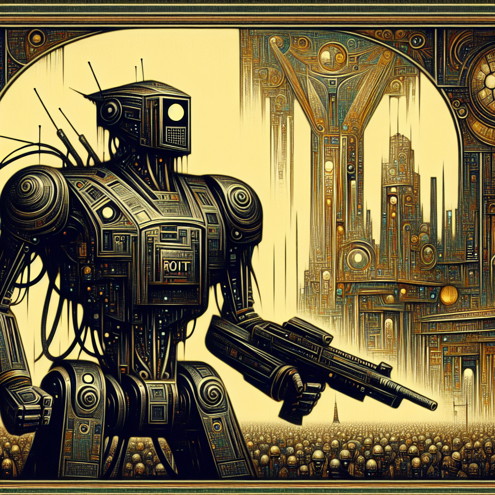

### 📷 57b23218e20770fb5fa8787a7f7fa31d 

| Field          | Value                                                                                                                     |
|----------------|---------------------------------------------------------------------------------------------------------------------------|
| **Image ID**             | 57b23218e20770fb5fa8787a7f7fa31d                                                                                                             |
| **Title**           | Futuristic Riot Police Robot on Patrol                                                                                                       |
| **Description**           | Generate an image of a dystopian future featuring an imposing, technologically advanced riot control robot with an aesthetic drawn from the intersection of technology and law enforcement. The robot should be rendered in a striking, visionary, and intricate style, evoking the atmosphere of a speculative fiction novel cover from the mid-century period. The background presents a world not yet known to us, filled with sci-futuristic elements. The atmospheric design, drawing inspiration from the imagination of pre-1912 artists, uses heavily stylized visual cues to portray a futuristic city.                                                                                                       |
| **CreatedAt**        | 2024-03-19 01:23:35.297602                                                                                                        |
| **OpenAI**         | [OpenAI Image URL](https://oaidalleapiprodscus.blob.core.windows.net/private/org-TZj0gKpq3CiXdXNznVOkBYav/user-t5KW5S6yYiCS0u4yDWasqnEP/img-lHFFD2eUdaoAcDyUuMT48vcb.png?st=2024-03-19T00%3A23%3A31Z&se=2024-03-19T02%3A23%3A31Z&sp=r&sv=2021-08-06&sr=b&rscd=inline&rsct=image/png&skoid=6aaadede-4fb3-4698-a8f6-684d7786b067&sktid=a48cca56-e6da-484e-a814-9c849652bcb3&skt=2024-03-19T00%3A26%3A30Z&ske=2024-03-20T00%3A26%3A30Z&sks=b&skv=2021-08-06&sig=0RNN/ThsuFuMfL8QhY6Zy1GiXwkTOUYr2pz%2BU7nFo6A%3D)                                                                                |
| **GitHub**         | [GitHub Image URL](https://github.com/Caneta-Silva/cyber-tomorrow/blob/main/images/57b23218e20770fb5fa8787a7f7fa31d/57b23218e20770fb5fa8787a7f7fa31d.jpg)                                                                                |
| **Tags**       | None                                                                                                                   |

### 📜 1f6ee357-e3ed-47e6-b15b-616927777d32

> Generate an image of a dystopian future featuring an imposing, technologically advanced riot control robot with an aesthetic drawn from the intersection of technology and law enforcement. The robot should be rendered in a striking, visionary, and intricate style, evoking the atmosphere of a speculative fiction novel cover from the mid-century period. The background presents a world not yet known to us, filled with sci-futuristic elements. The atmospheric design, drawing inspiration from the imagination of pre-1912 artists, uses heavily stylized visual cues to portray a futuristic city.

| Field          | Value                                                                                                                                                                      |
|----------------|----------------------------------------------------------------------------------------------------------------------------------------------------------------------------|
| **Prompt ID**  | 1f6ee357-e3ed-47e6-b15b-616927777d32                                                                                                                                                            |
| **Prompt History** | <ul><li>**Input:**    **Output:**    **Type:** </li></ul><ul><li>**Input:** Create a landscape full body image of a futuristic riot police robot in the style of Bob Pepper   **Output:** Immerse yourself in a futuristic world with this striking image of a riot police robot designed in the style reminiscent of artist Bob Pepper. With its imposing presence and cutting-edge design, this robot stands ready to maintain order in a world unknown to us. The attention to detail and atmospheric rendering bring this sci-fi landscape to life, capturing the essence of a distant future where technology and law enforcement intersect.   **Type:** enhanced</li></ul><ul><li>**Input:** Immerse yourself in a futuristic world with this striking image of a riot police robot designed in the style reminiscent of artist Bob Pepper. With its imposing presence and cutting-edge design, this robot stands ready to maintain order in a world unknown to us. The attention to detail and atmospheric rendering bring this sci-fi landscape to life, capturing the essence of a distant future where technology and law enforcement intersect.   **Output:** Generate an image of a dystopian future featuring an imposing, technologically advanced riot control robot with an aesthetic drawn from the intersection of technology and law enforcement. The robot should be rendered in a striking, visionary, and intricate style, evoking the atmosphere of a speculative fiction novel cover from the mid-century period. The background presents a world not yet known to us, filled with sci-futuristic elements. The atmospheric design, drawing inspiration from the imagination of pre-1912 artists, uses heavily stylized visual cues to portray a futuristic city.   **Type:** revised</li></ul> |
| **Created At** |                                                                                                                                                    |
| **Revised At** | 2024-03-19 01:23:33.217218                                                                                                                                                   |
| **Revised Prompt** | Yes                                                                                                                                                                      |
| **Enhanced At** | 2024-03-19 01:22:50.337940                                                                                                                                                  |
| **Enhanced Prompt** | Yes                                                                                                                                                                    |
| **Metadata**   | <ul><li>**Element:** riot police robot   **Style:** Bob Pepper   **Aspect Ratio:** landscape   **Backdrop:** fortress   **Animal:** elephant   **Modifiers:**<ul><li>**Image:** full body</li><li>**Element:** futuristic</li><li>**Backdrop:** alien</li></ul></li></ul> |
| **Template**   | Create a {{ aspect_ratio }} {{ modifiers.image }} image of a {{ modifiers.element }} {{ element }} in the style of {{ style }}                                                                                                                                           |

