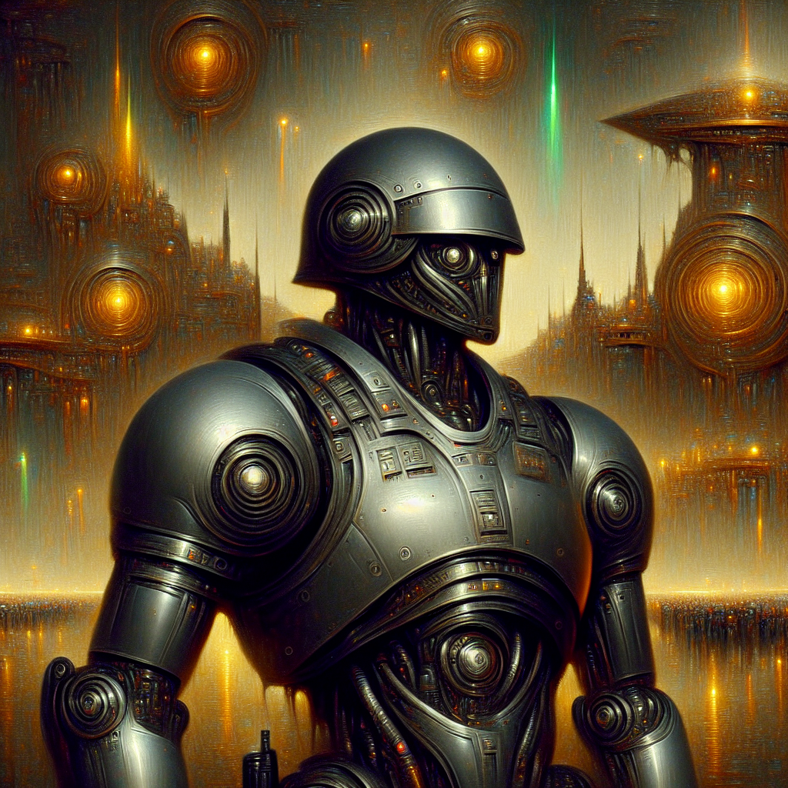

| Field          | Value                                                                                                                     |
|----------------|---------------------------------------------------------------------------------------------------------------------------|
| id             | 91fe12c255d17c01c5861f15d8af0163                                                                                                             |
| name           | Sentinel of the Alien Citadel: Futuristic Riot Police Automaton in Victorian Romanticism Style                                                                                                       |
| created        | 2024-03-17 23:46:32.819267                                                                                                        |
| revised_prompt |                                                                                                 |
| prompt         | Construct an image of a futuristic riot police robot in full body view against the backdrop of an extraterrestrial stronghold. The robot is heavily armored, with smooth, metallic surfaces reflecting the strange colored lights emanating from the alien fortress. The style should emulate that which was common in the era of Victorian Romanticism art, characterized by its dramatic intensity, intricate detail, and surreal aesthetics, a style evident in artworks of the late 19th century. The primary medium should resemble that of traditional oil paints on canvas.                                                                                                         |
| tags           | futuristic, riot police, robot, full body view, extraterrestrial stronghold, heavily armored, metallic surfaces, alien fortress, Victorian Romanticism art, dramatic intensity, intricate detail, surreal aesthetics, late 19th century, traditional oil paints, canvas                                                                                              |
| openai         | [OpenAI Image URL](https://oaidalleapiprodscus.blob.core.windows.net/private/org-TZj0gKpq3CiXdXNznVOkBYav/user-t5KW5S6yYiCS0u4yDWasqnEP/img-rdiDsutBPFsbr6IesPj0LwYR.png?st=2024-03-17T22%3A46%3A28Z&se=2024-03-18T00%3A46%3A28Z&sp=r&sv=2021-08-06&sr=b&rscd=inline&rsct=image/png&skoid=6aaadede-4fb3-4698-a8f6-684d7786b067&sktid=a48cca56-e6da-484e-a814-9c849652bcb3&skt=2024-03-17T22%3A47%3A54Z&ske=2024-03-18T22%3A47%3A54Z&sks=b&skv=2021-08-06&sig=9ewHcXsOrNJ4GDriiOqw/EtnrhNminZW4pRas8anlbQ%3D)                                                                                |
| github         | [GitHub Image URL](https://github.com/Caneta-Silva/cyber-tomorrow/blob/main/images/91fe12c255d17c01c5861f15d8af0163/91fe12c255d17c01c5861f15d8af0163.jpg)                                                                                |
