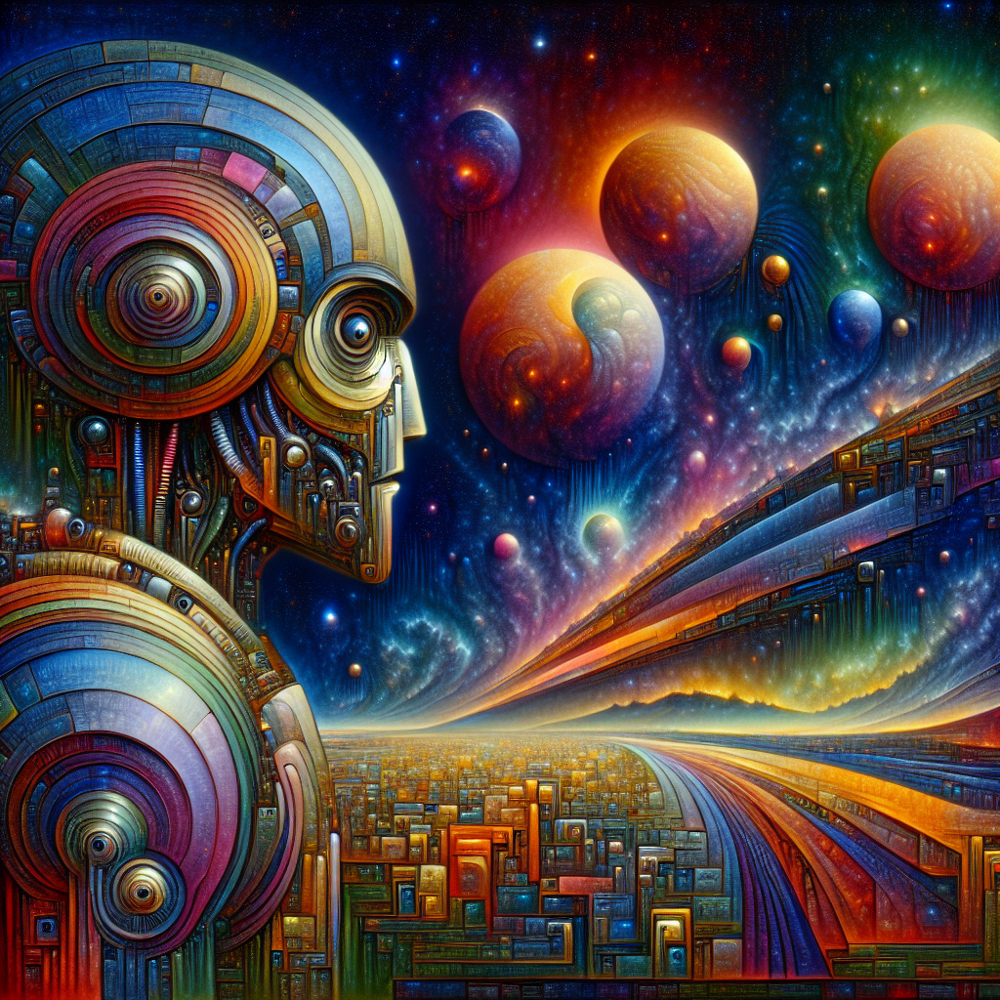

### 📷 961ce9b419cf445ede43fcf1f3fb4ecd 

| Field          | Value                                                                                                                     |
|----------------|---------------------------------------------------------------------------------------------------------------------------|
| **Image ID**             | 961ce9b419cf445ede43fcf1f3fb4ecd                                                                                                             |
| **Title**           | Guardians of the Future: Alien Riot Police Robot                                                                                                       |
| **Description**           | Envision a riveting landscape portrait of a full-bodied extraterrestrial riot control automaton. Instead of a modern take, imagine this in an intricate, surrealist style reminiscent of works prior to 1912, using vibrant color palettes, strange dreamlike scenarios, and unusual, paradoxical elements. The background artfully showcases the exterior of a futuristic interstellar spaceship, enveloping the background and contributing to a captivatingly alien ambiance. The overall work possesses high levels of detail, depth and dramatic lighting, providing a profound sense of advanced, otherworldly technology.                                                                                                       |
| **CreatedAt**        | 2024-11-29 19:01:22.604292                                                                                                        |
| **Model**        | dall-e-3                                                                                                        |
| **OpenAI**         | [OpenAI Image URL](https://oaidalleapiprodscus.blob.core.windows.net/private/org-TZj0gKpq3CiXdXNznVOkBYav/user-t5KW5S6yYiCS0u4yDWasqnEP/img-3H0lLuMET6oiC3D1qxI0Vj9f.png?st=2024-11-29T18%3A01%3A15Z&se=2024-11-29T20%3A01%3A15Z&sp=r&sv=2024-08-04&sr=b&rscd=inline&rsct=image/png&skoid=d505667d-d6c1-4a0a-bac7-5c84a87759f8&sktid=a48cca56-e6da-484e-a814-9c849652bcb3&skt=2024-11-29T03%3A05%3A35Z&ske=2024-11-30T03%3A05%3A35Z&sks=b&skv=2024-08-04&sig=%2B//64UV7Pm9MdbHHcuQ4f6blBZC%2ByOEXY4QM1Cm0dic%3D)                                                                                |
| **GitHub**         | [GitHub Image URL](https://github.com/Caneta-Silva/cyber-tomorrow/blob/main/images/961ce9b419cf445ede43fcf1f3fb4ecd/961ce9b419cf445ede43fcf1f3fb4ecd.jpg)                                                                                |
| **Tags**       | None                                                                                                                   |

### 📜 1a37997ec76199d3237d94a2fca410ed

> Envision a riveting landscape portrait of a full-bodied extraterrestrial riot control automaton. Instead of a modern take, imagine this in an intricate, surrealist style reminiscent of works prior to 1912, using vibrant color palettes, strange dreamlike scenarios, and unusual, paradoxical elements. The background artfully showcases the exterior of a futuristic interstellar spaceship, enveloping the background and contributing to a captivatingly alien ambiance. The overall work possesses high levels of detail, depth and dramatic lighting, providing a profound sense of advanced, otherworldly technology.

| Field          | Value                                                                                                                                                                      |
|----------------|----------------------------------------------------------------------------------------------------------------------------------------------------------------------------|
| **Prompt ID**  | 1a37997ec76199d3237d94a2fca410ed                                                                                                                                                            |
| **Prompt History** | <ul><li>**Input:**    **Output:**    **Type:** </li></ul><ul><li>**Input:** Create a landscape full body image of a alien riot police robot in the style of Rafal Olbinski against the backdrop of a futuristic alien spaceship   **Output:** Envision a riveting landscape portrait of a full-bodied extraterrestrial riot control automaton. Instead of a modern take, imagine this in an intricate, surrealist style reminiscent of works prior to 1912, using vibrant color palettes, strange dreamlike scenarios, and unusual, paradoxical elements. The background artfully showcases the exterior of a futuristic interstellar spaceship, enveloping the background and contributing to a captivatingly alien ambiance. The overall work possesses high levels of detail, depth and dramatic lighting, providing a profound sense of advanced, otherworldly technology.   **Type:** revised</li></ul> |
| **Created At** |                                                                                                                                                    |
| **Revised At** | 2024-11-29 19:01:21.037916                                                                                                                                                   |
| **Revised Prompt** | Yes                                                                                                                                                                      |
| **Enhanced At** | None                                                                                                                                                  |
| **Enhanced Prompt** | No                                                                                                                                                                    |
| **Metadata**   | <ul><li>**Element:** riot police robot   **Style:** Rafal Olbinski   **Aspect Ratio:** landscape   **Backdrop:** spaceship   **Animal:** gnu   **Modifiers:**<ul><li>**Image:** full body</li><li>**Element:** alien</li><li>**Backdrop:** futuristic alien</li></ul></li></ul> |
| **Template**   | Create a {{ aspect_ratio }} {{ modifiers.image }} image of a {{ modifiers.element }} {{ element }} in the style of {{ style }} against the backdrop of a {{ modifiers.backdrop }} {{ backdrop }}                                                                                                                                           |

