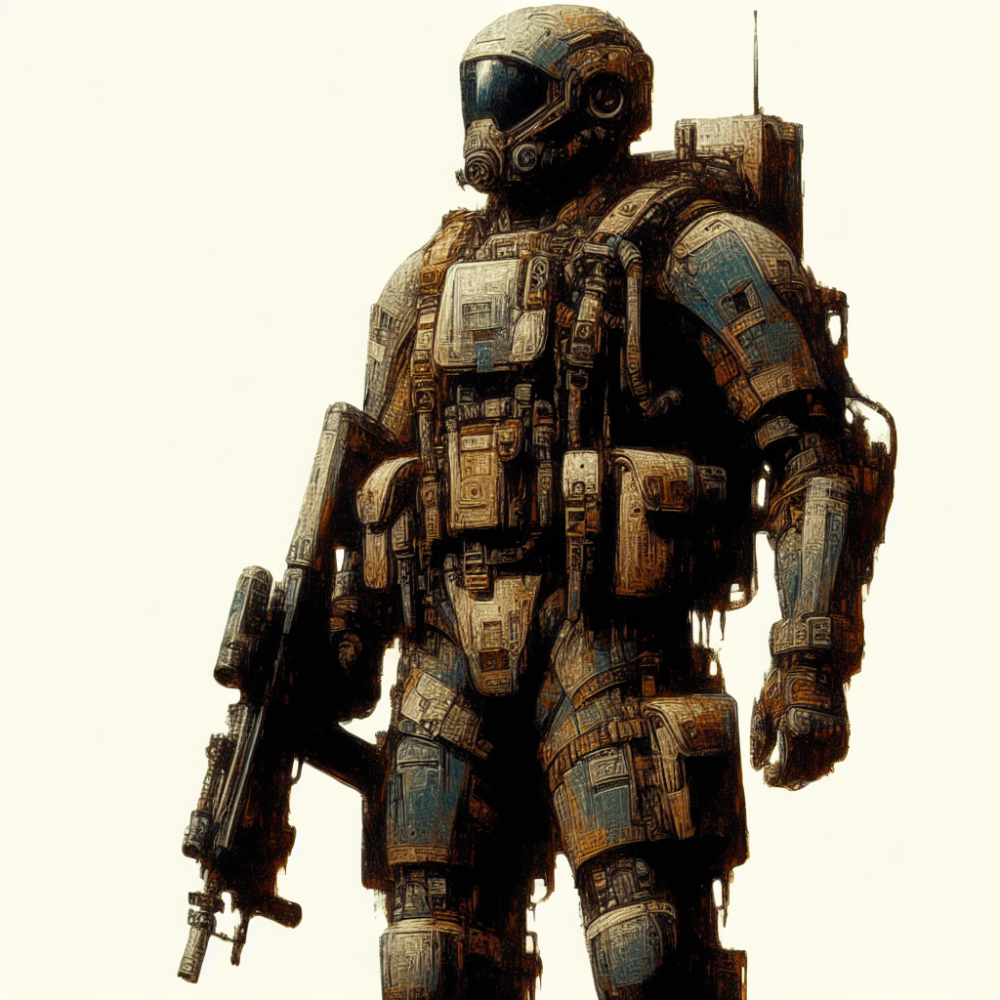

### 📷 fa630e93f51b78a2f8de51413ff220ee 

| Field          | Value                                                                                                                     |
|----------------|---------------------------------------------------------------------------------------------------------------------------|
| **Image ID**             | fa630e93f51b78a2f8de51413ff220ee                                                                                                             |
| **Title**           |                                                                                                        |
| **Description**           | Generate an image of a full body landscape of a futuristic paladin style military personnel. The art style should feel evocative, atmospheric, and immersive, reflective of an era akin to late 19th century illustrations. The primary medium should be reminiscent of oil or acrylic paint, focusing heavily on the use of detailed textures and subtly contrasted light and dark shades.                                                                                                       |
| **CreatedAt**        | 2024-03-19 00:17:28.078180                                                                                                        |
| **Prompt**         | Generate an image of a full body landscape of a futuristic paladin style military personnel. The art style should feel evocative, atmospheric, and immersive, reflective of an era akin to late 19th century illustrations. The primary medium should be reminiscent of oil or acrylic paint, focusing heavily on the use of detailed textures and subtly contrasted light and dark shades.                                                                                                         |                                                                                          |
| **OpenAI**         | [OpenAI Image URL](https://oaidalleapiprodscus.blob.core.windows.net/private/org-TZj0gKpq3CiXdXNznVOkBYav/user-t5KW5S6yYiCS0u4yDWasqnEP/img-PnSGFdX16UpL6YK0dA7BvZxh.png?st=2024-03-18T23%3A17%3A24Z&se=2024-03-19T01%3A17%3A24Z&sp=r&sv=2021-08-06&sr=b&rscd=inline&rsct=image/png&skoid=6aaadede-4fb3-4698-a8f6-684d7786b067&sktid=a48cca56-e6da-484e-a814-9c849652bcb3&skt=2024-03-19T00%3A12%3A00Z&ske=2024-03-20T00%3A12%3A00Z&sks=b&skv=2021-08-06&sig=ohl5y/iihRb7eBpOrqc/BLzhFhVPHvyocGora7mkxEI%3D)                                                                                |
| **GitHub**         | [GitHub Image URL](https://github.com/Caneta-Silva/cyber-tomorrow/blob/main/images/fa630e93f51b78a2f8de51413ff220ee/fa630e93f51b78a2f8de51413ff220ee.jpg)                                                                                |
| **Tags**       | None                                                                                                                   |

### 📜 ce3fc785-22bd-4d2d-b07a-e159045cbdd5

> Generate an image of a full body landscape of a futuristic paladin style military personnel. The art style should feel evocative, atmospheric, and immersive, reflective of an era akin to late 19th century illustrations. The primary medium should be reminiscent of oil or acrylic paint, focusing heavily on the use of detailed textures and subtly contrasted light and dark shades.

| Field          | Value                                                                                                                                                                      |
|----------------|----------------------------------------------------------------------------------------------------------------------------------------------------------------------------|
| **Prompt ID**  | ce3fc785-22bd-4d2d-b07a-e159045cbdd5                                                                                                                                                            |
| **Prompt History** | <ul><li>**Input:**    **Output:**    **Type:** </li></ul><ul><li>**Input:** Create a landscape full body image of a futuristic paladin style military in the style of John Schoenherr   **Output:** Generate an image of a full body landscape of a futuristic paladin style military personnel. The art style should feel evocative, atmospheric, and immersive, reflective of an era akin to late 19th century illustrations. The primary medium should be reminiscent of oil or acrylic paint, focusing heavily on the use of detailed textures and subtly contrasted light and dark shades.   **Type:** revised</li></ul> |
| **Created At** |                                                                                                                                                    |
| **Revised At** | 2024-03-19 00:17:26.394660                                                                                                                                                   |
| **Revised Prompt** | Yes                                                                                                                                                                      |
| **Enhanced At** | None                                                                                                                                                  |
| **Enhanced Prompt** | No                                                                                                                                                                    |
| **Metadata**   | <ul><li>**Element:** paladin style military   **Style:** John Schoenherr   **Aspect Ratio:** landscape   **Backdrop:** Martial landscape   **Animal:** camel   **Modifiers:**<ul><li>**Image:** full body</li><li>**Element:** futuristic</li><li>**Backdrop:** futuristic</li></ul></li></ul> |
| **Template**   | Create a {{ aspect_ratio }} {{ modifiers.image }} image of a {{ modifiers.element }} {{ element }} in the style of {{ style }}                                                                                                                                           |

